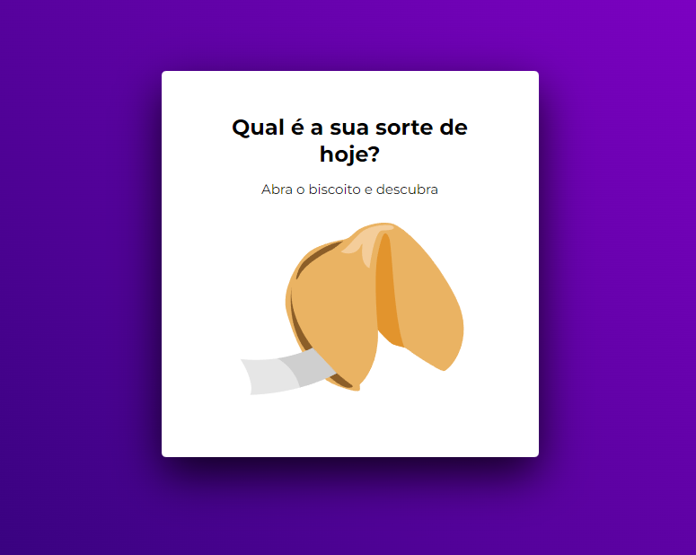
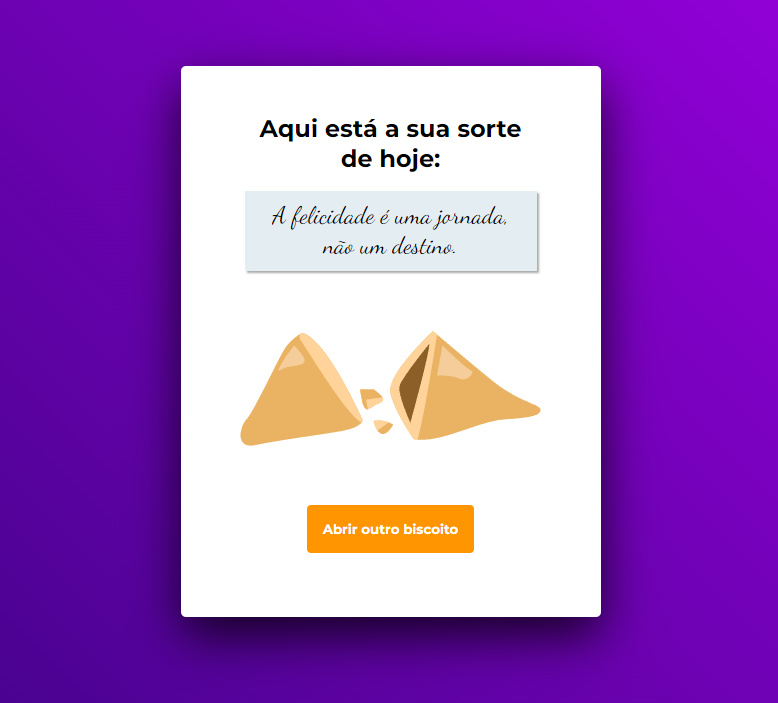

<h1 align="center">Fortune cookie (with js)</h1>

<strong>PT-BR</strong>: Biscoito da sorte (com JS)

 

 

  

 

## 🚀 Technologies 
<strong>EN:</strong> This project was developed with the following technologies:

-----
<strong>PT-BR:</strong> Esse projeto foi desenvolvido com as seguintes tecnologias:

- HTML 
- CSS
- JavaScript
- Git e Github
- Figma

 

## 📖 Concepts
<strong>EN:</strong> Concepts:
- Data structure in HTML
- Animations in CSS
- Functions in JS
- DOM manipulation
- JS Math() Library
- Callback function
- Arrays 
 

<strong>PT-BR:</strong> Conceitos utilizados:
- Estrutura de dados HTML
- Animações com CSS
- Funções no Javascript
- Manipulação da DOM
- Biblioteca JS Math()
- Funções callback
- Arrays

 

## 📖 Project
<strong>EN:</strong> In this project, the idea is to click on the fortune cookie and receive a message. I made an array for the phrases and used the JS math() library to bring a randomic phrase everytime the button is clicked.
There were some new challenges regarding the use o JS to manipulate HTML structure and improve my logic skills. 
 
Project made in Rocketseat's course "Explorer".
 
The layout was sent via Figma.

----
<strong>PT-BR:</strong> Neste projeto a ideia é clicar no biscoito da sorte e receber uma mensagem. Para isso, criei uma array para as frases e usei o JS Math() para inserir frases randomicamente cada vez que o biscoito é clicado. Houveram novos desafios em relação a manipulação de dados do html com o javascript e também ajudou a melhorar a minha lógica de programação.
 
O layout para consulta foi enviado através da plataforma Figma.
 
Projeto feito no curso Explorer da Rocketseat.
 
 
- Online project: https://lidiabrentano.github.io/fortune-cookie/
 

-----

By Lídia Brentano 💜
